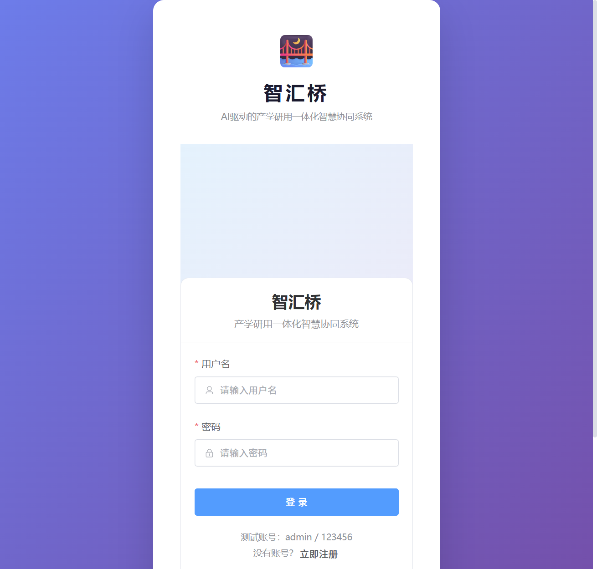
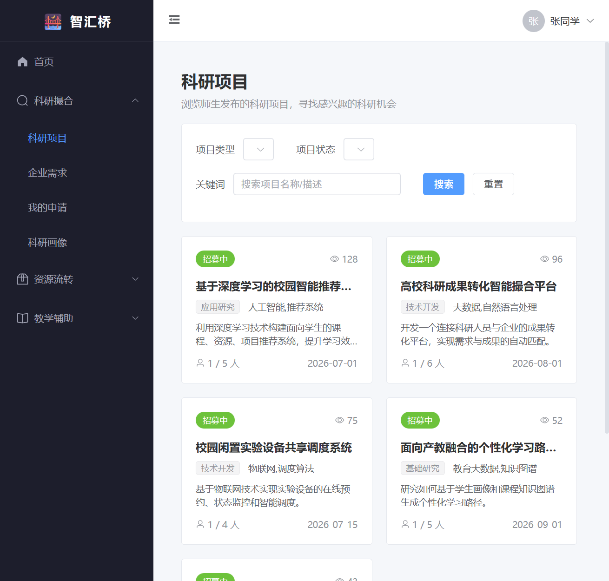
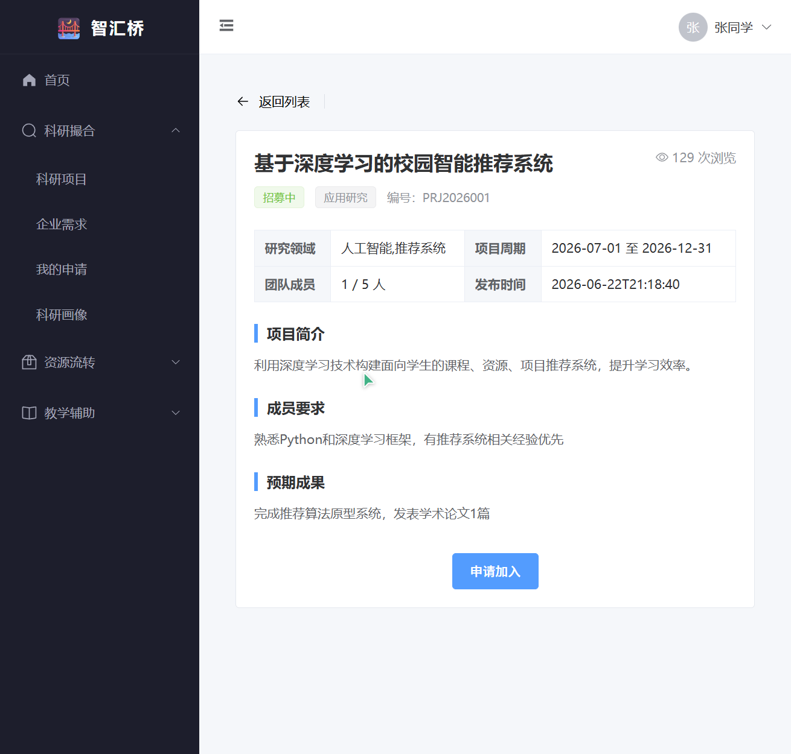
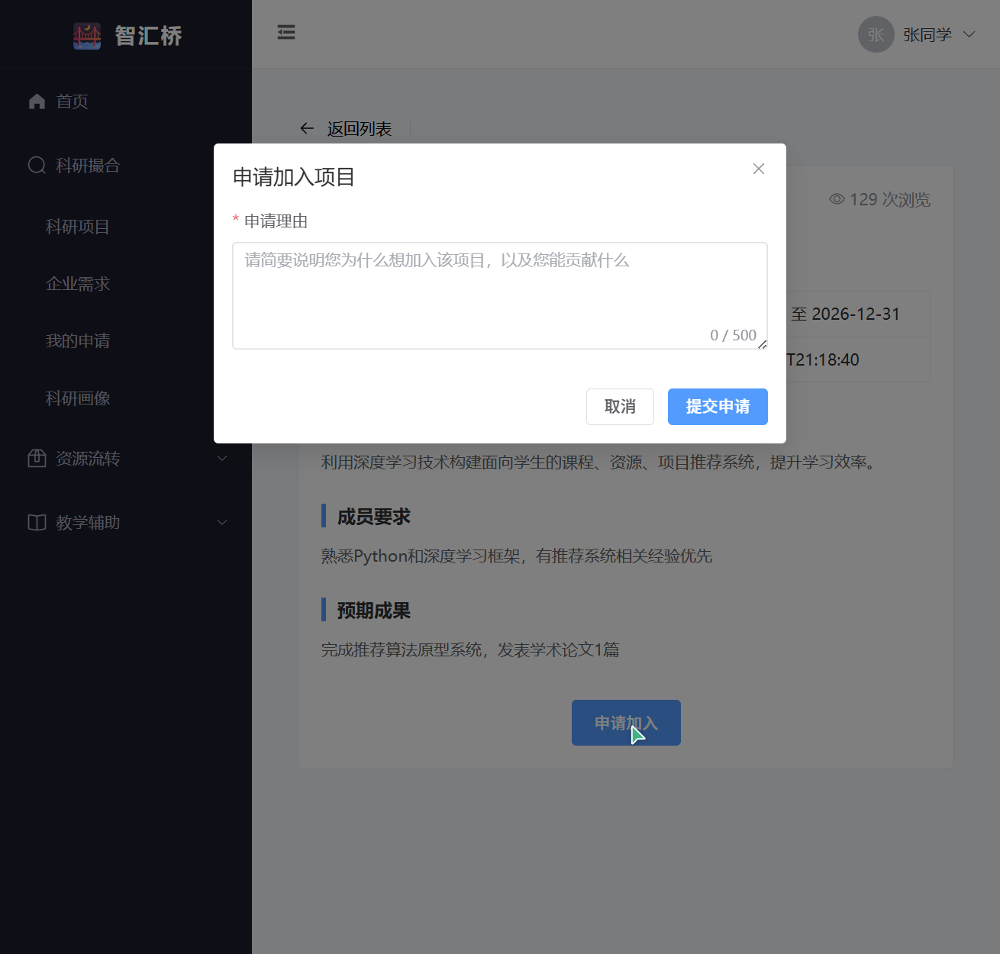
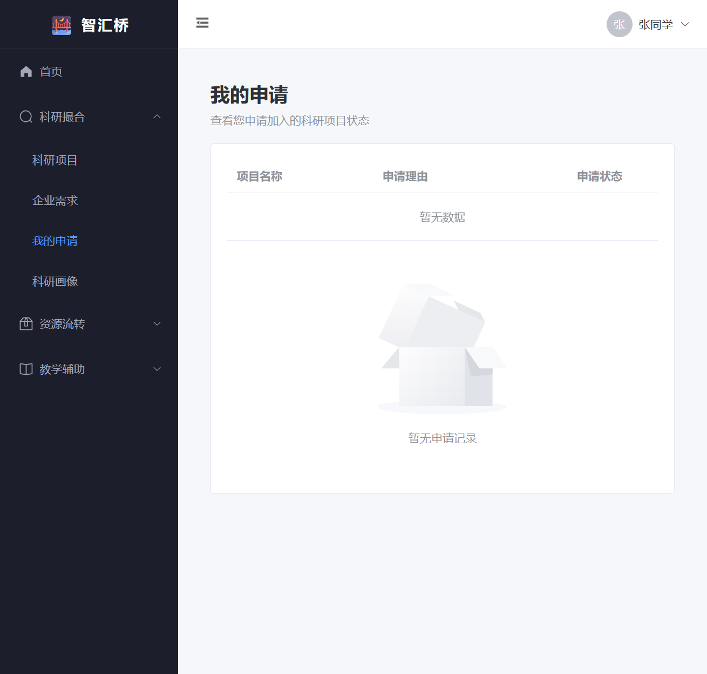
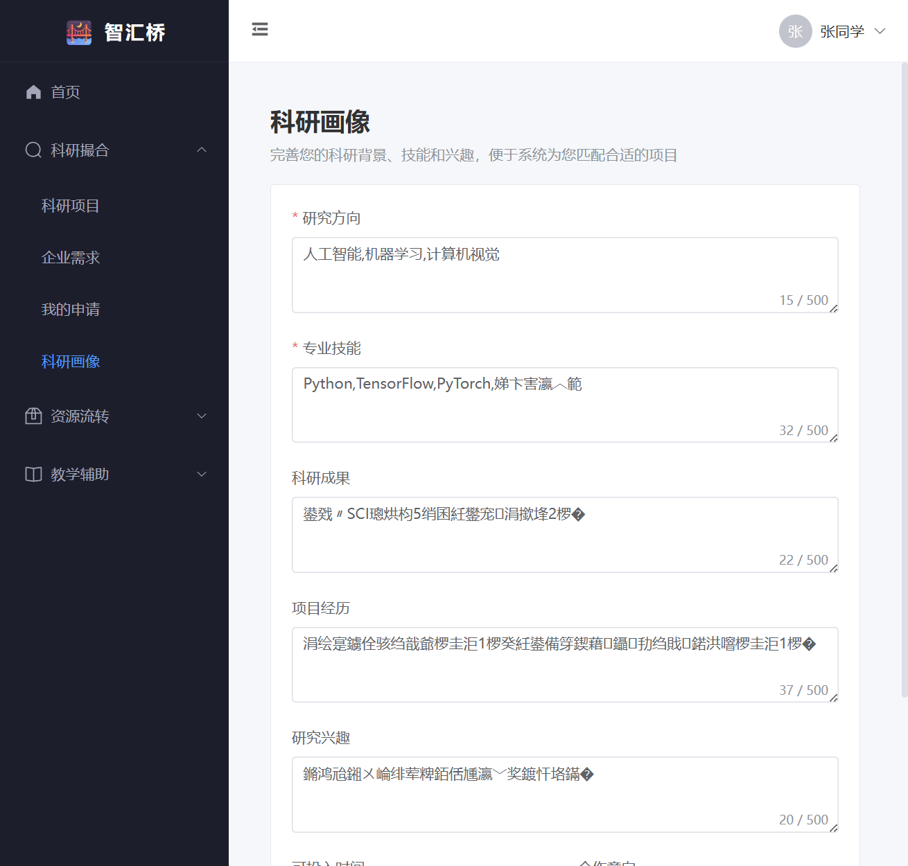
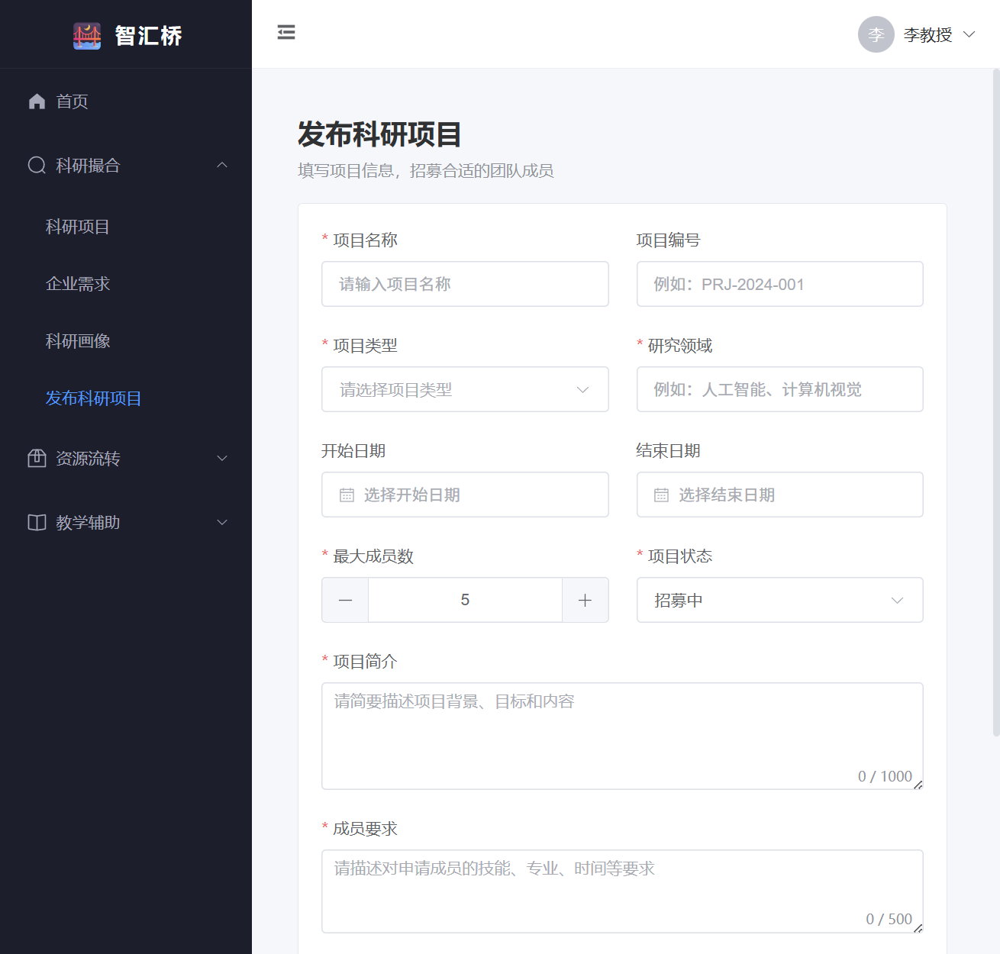
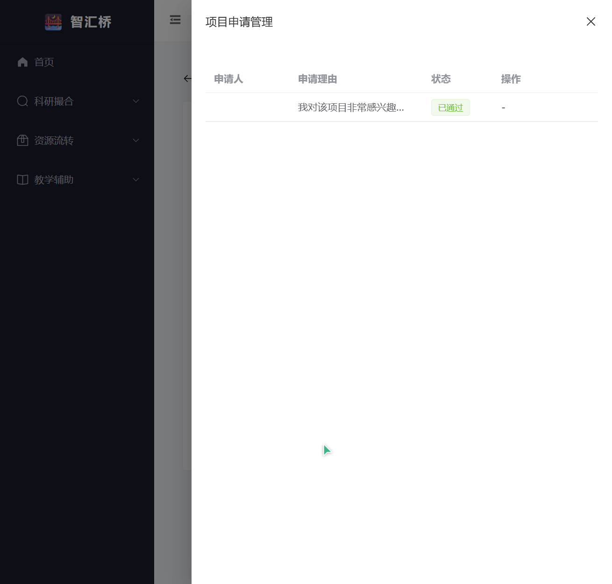
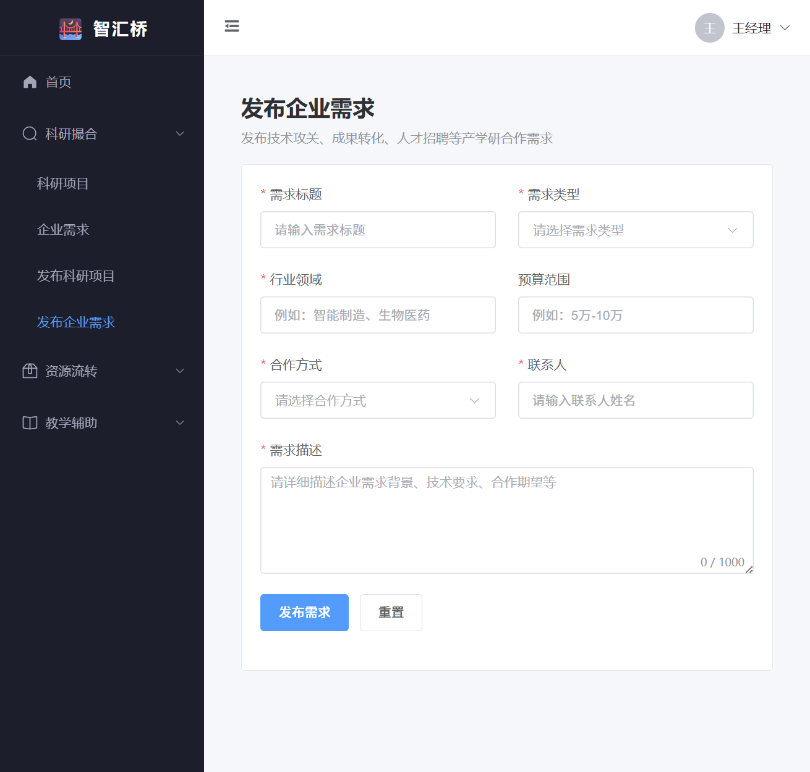
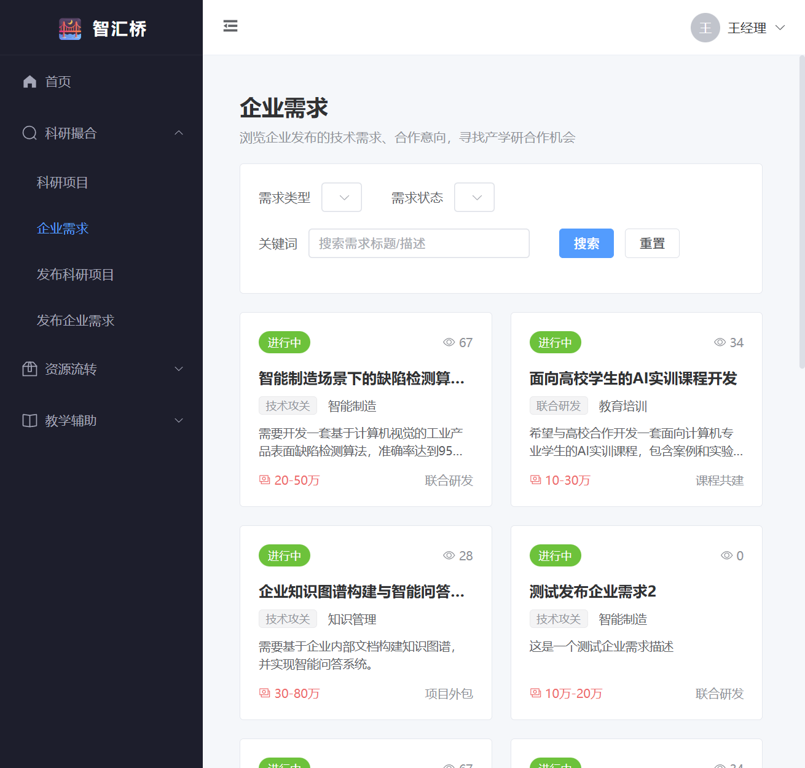

# 6月22日项目开发日志

## 「智汇桥」——AI驱动的产学研用一体化智慧协同系统

### 开发日志文档（Day 6）

---

### 一、项目基本信息

| 项目信息 | 内容 |
|---------|------|
| 项目名称 | 智汇桥——AI驱动的产学研用一体化智慧协同系统 |
| 项目定位 | 连接教师、学生、实验室与校企资源，打造师-生-机协同的智慧校园中心 |
| 核心模块 | 科研项目智能撮合、校园闲置资源流转、教学辅助个性化支持 |
| 前端技术栈 | Vue 3.5 + Vite 8 + Element Plus 2.14 + Pinia 3 + Vue Router 5 + Axios |
| 后端技术栈 | Spring Boot 3.1.6 + JDK 17 + MyBatis-Plus 3.5.6 + Spring Security + JWT |
| 数据库 | MySQL 8.0（UTF8MB4 编码） |
| 文档日期 | 2026年6月22日 |

---

### 二、今日工作目标

Day 6 的核心目标是完成**科研撮合模块前端剩余页面**的开发与前后端联调，并进行前端构建检查与功能验证，最终形成图文结合的开发日志。

具体目标包括：

1. 完成前端构建检查（`npm run build`），确保生产构建无类型错误。
2. 完成科研撮合模块前端页面开发：
   - 项目详情页「申请审核」功能
   - 我的申请列表页
   - 科研项目发布页
   - 企业需求发布页
   - 科研画像编辑页
3. 修复科研项目发布接口 `publisher_id` 字段缺失导致的 500 错误。
4. 前后端联调验证注册、登录、项目列表、需求列表、项目申请、审核等核心流程。
5. 截取关键页面截图，整理到 `docs/day6/` 目录，并写入开发日志。

---

### 三、今日完成内容

#### 3.1 前端构建检查

对前端工程执行生产构建：

```powershell
# 在前端项目根目录执行生产构建
npm run build
```

构建结果：

- `vue-tsc -b` 类型检查通过，无 TypeScript 类型错误。
- `vite build` 成功，所有页面组件正常打包。
- 产出目录为 `zhihuiqiao-frontend/dist/`，资源文件完整。

> 构建过程中仅有依赖包（`@vueuse/core`）的 `/* #__PURE__ */` 注释位置警告，以及部分 chunk 超过 500 kB 的体积提示，均不影响功能正确性，后续可通过代码分割进一步优化。

---

#### 3.2 科研撮合模块前端页面开发

##### 3.2.1 项目详情页——申请与审核功能

文件：`src/views/research/ProjectDetail.vue`

完成内容：

- 在项目详情页底部新增「申请加入」按钮，学生角色可点击弹出申请对话框。
- 申请对话框包含申请理由输入，提交后调用 `POST /api/research/application` 接口。
- 对于项目发布者（教师/负责人），新增「查看申请」按钮，点击后弹出申请管理抽屉。
- 申请管理抽屉展示该项目下所有申请记录，支持「通过」和「拒绝」两种审核操作。
- 审核通过后，后端自动更新项目当前成员数，并防止同一学生重复申请。

关键逻辑说明：

```typescript
// 加载项目申请列表
async function loadApplications() {
  applicationsLoading.value = true
  try {
    const res: any = await getProjectApplications(projectId)
    applications.value = res.data || []
  } catch (error) {
    ElMessage.error('加载申请列表失败')
    console.error(error)
  } finally {
    applicationsLoading.value = false
  }
}

// 审核申请：status 为 'approved' 或 'rejected'
async function handleAudit(id: number, status: string) {
  try {
    const res: any = await auditApplication(id, status)
    if (res.code === 200) {
      ElMessage.success(status === 'approved' ? '已通过申请' : '已拒绝申请')
      loadApplications()
    } else {
      ElMessage.error(res.message || '审核失败')
    }
  } catch (error) {
    ElMessage.error('审核失败')
    console.error(error)
  }
}
```

##### 3.2.2 我的申请列表页

文件：`src/views/research/MyApplications.vue`

完成内容：

- 以学生身份展示当前登录用户提交的所有项目申请记录。
- 表格展示：项目名称（可跳转详情）、申请理由、申请状态、审核回复、申请时间。
- 使用 `el-tag` 根据状态渲染不同颜色：`pending`（待审核）、`approved`（已通过）、`rejected`（已拒绝）。

##### 3.2.3 科研项目发布页

文件：`src/views/research/ProjectPublish.vue`

完成内容：

- 开发完整的项目发布表单，包含：项目名称、项目编号、项目类型、研究领域、项目简介、成员要求、预期成果、项目状态、计划成员数、起止时间等字段。
- 使用 Element Plus 表单校验，确保必填字段完整。
- 提交时自动携带当前登录用户 `creatorId`，并补充 `currentMembers` 和 `views` 默认值。
- 发布成功后跳转至科研项目列表页。

##### 3.2.4 企业需求发布页

文件：`src/views/research/DemandPublish.vue`

完成内容：

- 开发企业需求发布表单，包含：需求标题、需求类型、行业领域、需求描述、技术要求、预算范围、合作模式、联系方式等字段。
- 仅对企业用户和管理员角色开放菜单入口。
- 提交后调用 `POST /api/research/demand` 接口，发布成功后跳转至企业需求列表页。

##### 3.2.5 科研画像编辑页

文件：`src/views/research/ResearcherProfile.vue`

完成内容：

- 开发科研画像表单，包含：研究方向、专业技能、科研成果、个人简介等字段。
- 支持学生、教师角色完善个人科研背景信息。
- 表单提交时若已有画像则更新，否则创建新记录。

##### 3.2.6 路由与菜单配置

文件：`src/router/index.ts`、`src/layout/MainLayout.vue`

完成内容：

- 在路由表中注册新页面：
  - `/app/research/applications` —— 我的申请
  - `/app/research/project/publish` —— 发布科研项目
  - `/app/research/demand/publish` —— 发布企业需求
  - `/app/research/profile` —— 科研画像
- 在主布局侧边栏中根据用户角色动态显示对应菜单项：
  - 学生：科研项目、企业需求、我的申请、科研画像
  - 教师：科研项目、企业需求、科研画像、发布科研项目
  - 企业：科研项目、企业需求、发布企业需求
  - 管理员：全部菜单

---

#### 3.3 后端接口修复

文件：`src/main/java/com/zhihuiqiao/controller/ResearchController.java`

问题：科研项目发布接口调用时，数据库表 `research_project` 的 `publisher_id` 字段无默认值，前端又未传递该字段，导致后端返回 500「系统繁忙，请稍后再试」。

修复方案：

```java
@Operation(summary = "发布科研项目")
@PostMapping("/project")
public Result<Long> publishProject(@RequestBody @Valid ResearchProject project) {
    // 从 SecurityContext 获取当前登录用户 ID，设置为发布者
    Authentication authentication = SecurityContextHolder.getContext().getAuthentication();
    if (authentication != null && authentication.getCredentials() instanceof Long userId) {
        project.setPublisherId(userId);
    }
    String roleType = getCurrentRoleType();
    project.setPublisherType(roleType);

    // 设置默认值：未指定状态时默认为招募中
    if (!StringUtils.hasText(project.getStatus())) {
        project.setStatus("recruiting");
    }
    if (project.getCurrentMembers() == null) {
        project.setCurrentMembers(1);
    }
    if (project.getViews() == null) {
        project.setViews(0);
    }
    researchProjectService.save(project);
    return Result.success(project.getId());
}
```

修复后，教师/管理员账号可正常发布科研项目，项目成功写入数据库并可在列表页展示。

---

#### 3.4 前后端联调验证

验证环境：

- 后端服务端口：`8081`
- 前端开发服务器端口：`5174`
- 测试账号：
  - 学生：`student01 / 123456`
  - 教师：`teacher01 / 123456`
  - 企业：`enterprise01 / 123456`
  - 管理员：`admin / 123456`

验证流程：

1. 注册/登录接口正常，JWT Token 成功写入 `localStorage`。
2. 请求拦截器自动在请求头中携带 `Authorization: Bearer <token>`。
3. 学生访问科研项目列表、项目详情、提交申请、查看我的申请、编辑科研画像，流程正常。
4. 教师访问发布项目页并成功发布项目，在项目详情页查看申请并进行审核，流程正常。
5. 企业访问发布需求页并成功发布需求，查看企业需求列表，流程正常。
6. 前端 `npm run build` 构建通过。

---

### 四、关键页面截图

以下截图为 Day 6 完成后，使用测试账号在本地开发环境实际访问各页面所得，图片统一存放于 `docs/day6/` 目录。

#### 4.1 登录页



> 登录页提供账号、密码输入与角色选择，登录成功后 Token 写入本地存储，并跳转至系统首页。

---

#### 4.2 学生视角——科研项目列表页



> 列表页展示科研项目卡片，支持关键词搜索、项目类型筛选、分页浏览。学生可点击卡片进入项目详情。

---

#### 4.3 学生视角——项目详情页



> 项目详情页展示项目完整信息，包括项目简介、成员要求、预期成果、起止时间等。学生可点击「申请加入」。

---

#### 4.4 学生视角——申请加入弹窗



> 学生填写申请理由后提交，系统校验是否重复申请，并返回成功或失败提示。

---

#### 4.5 学生视角——我的申请列表页



> 我的申请页以表格形式展示所有申请记录，包含项目名、申请理由、状态标签、审核回复和申请时间。

---

#### 4.6 学生视角——科研画像编辑页



> 学生/教师可在此完善研究方向、专业技能、科研成果和个人简介，为后续智能推荐提供数据基础。

---

#### 4.7 教师视角——发布科研项目页



> 教师/管理员可发布新的科研项目，表单包含项目基本信息、成员要求、预期成果、计划成员数与起止时间。

---

#### 4.8 教师视角——项目申请审核抽屉



> 项目发布者在项目详情页点击「查看申请」后，弹出申请管理抽屉，可对每条申请执行「通过」或「拒绝」操作。

---

#### 4.9 企业视角——发布企业需求页



> 企业用户可发布技术攻关、成果转化、人才招聘、联合研发等类型的需求，填写需求描述、技术要求、预算范围与合作模式。

---

#### 4.10 企业视角——企业需求列表页



> 企业需求列表页以卡片形式展示所有需求，支持按需求类型与行业领域筛选，点击查看详情。

---

### 五、遇到的问题与解决方法

| 序号 | 问题描述 | 原因分析 | 解决方法 |
|------|---------|---------|---------|
| 1 | 后端启动时提示 `Port 8081 was already in use` | 本地已有历史后端进程占用 8081 端口 | 直接使用已运行的后端服务，无需重复启动 |
| 2 | 科研项目发布接口返回 500 | `research_project` 表的 `publisher_id` 字段无默认值，前端未传递 | 在 `ResearchController.publishProject` 中从 `SecurityContext` 获取当前登录用户 ID 并设置 `publisherId` |
| 3 | 企业需求发布接口编译错误 | `EnterpriseDemand` 实体无 `publisherId` 字段 | 删除对 `setPublisherId` 的调用，仅设置 `enterpriseId` |
| 4 | 前端构建时部分 chunk 超过 500 kB | Element Plus 等依赖整体打包 | 当前不影响功能，后续可通过动态导入（`import()`）进一步优化 |

---

### 六、明日工作计划（2026年6月23日）

| 序号 | 工作内容 | 预计产出 |
|------|---------|---------|
| 1 | 继续资源流转模块前端页面联调（预约、审批、归还） | 资源预约全流程跑通 |
| 2 | 完善科研撮合模块细节（如项目状态自动更新、申请状态实时刷新） | 模块体验更稳定 |
| 3 | 开始首页数据看板与管理后台页面开发 | 首页展示真实统计数据 |
| 4 | 编写接口测试用例或 Postman 集合 | 便于后续回归测试 |

---

### 七、备注

- 今日已完成科研撮合模块前端全部核心页面开发与联调，学生申请、教师审核、项目发布、需求发布、科研画像等功能均验证通过。
- 前端生产构建通过，无阻塞性错误。
- 所有关键页面截图已保存至 `docs/day6/` 目录，并嵌入本日志文档，便于后续汇报与复盘。
- 资源流转模块后端已在前期完成，明日重点推进其前端联调与首页看板开发。

**记录人**：罗智峰  
**日期**：2026年6月22日
