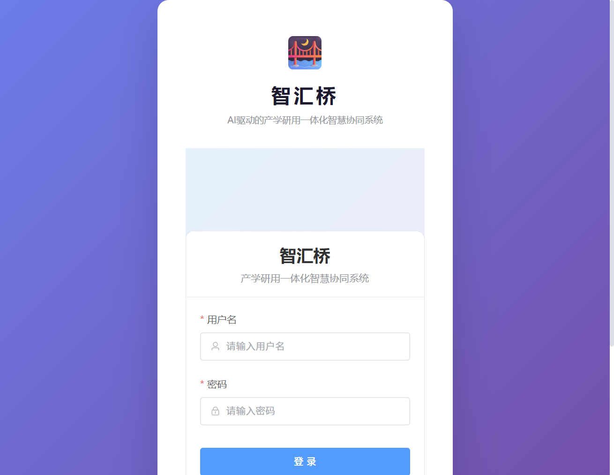
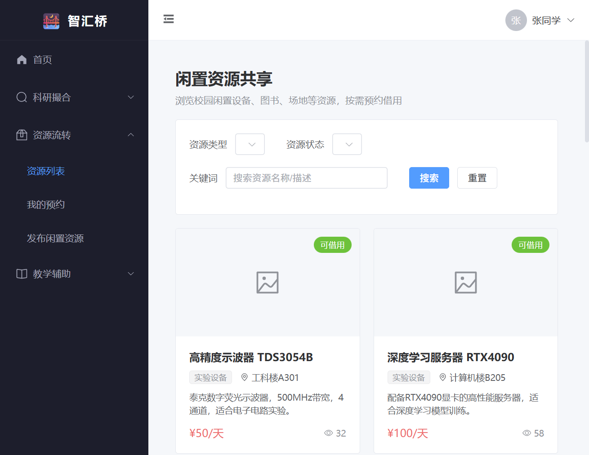
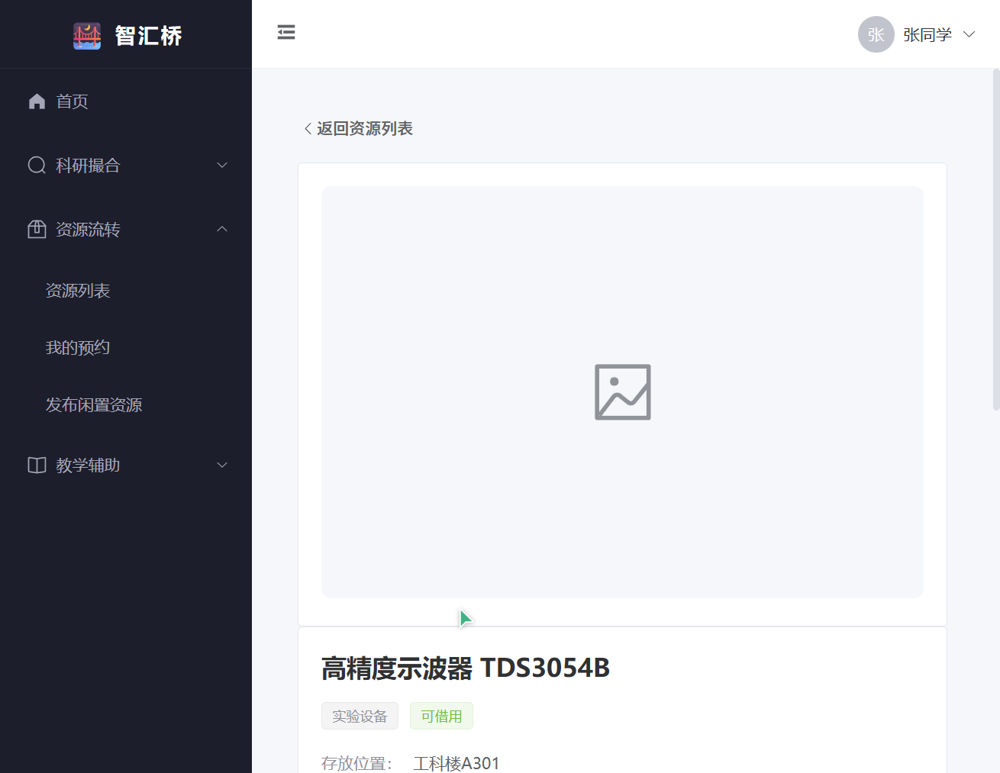
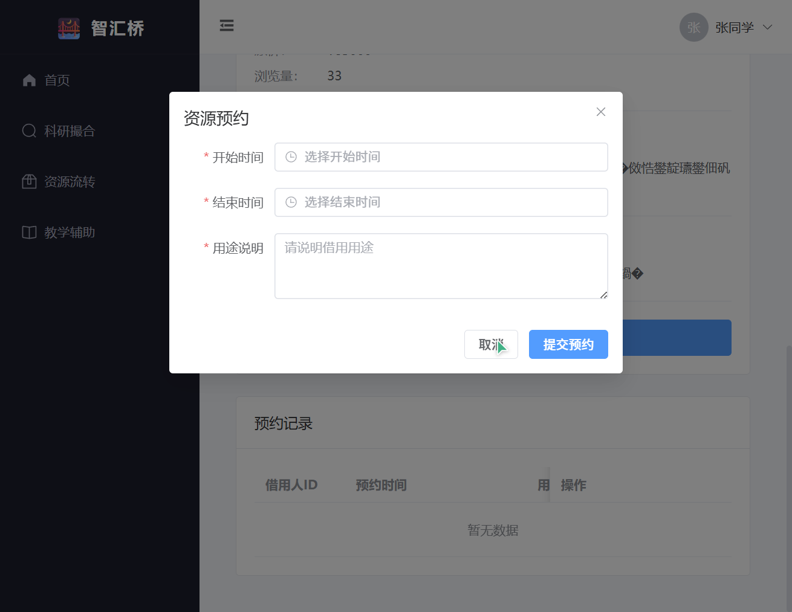
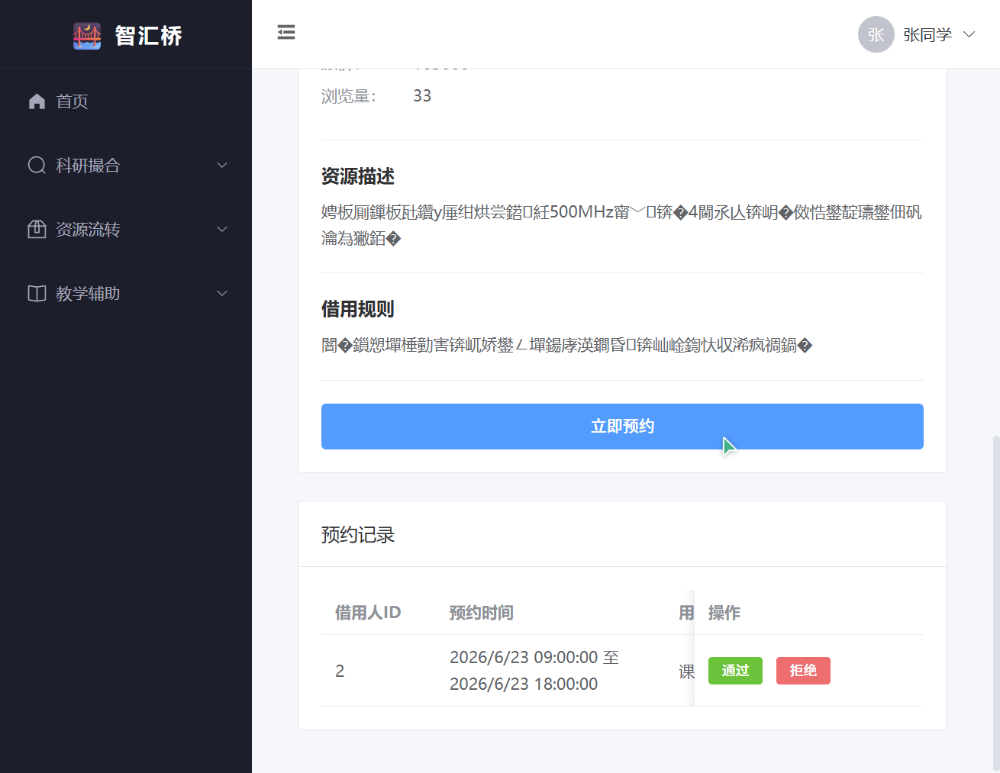
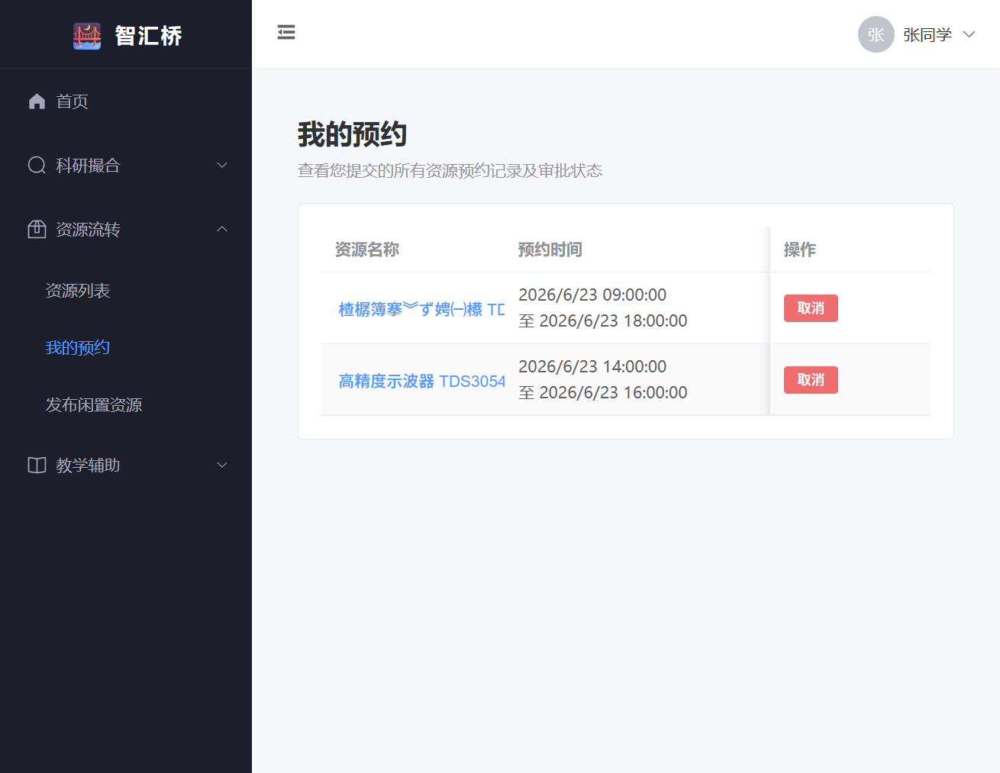
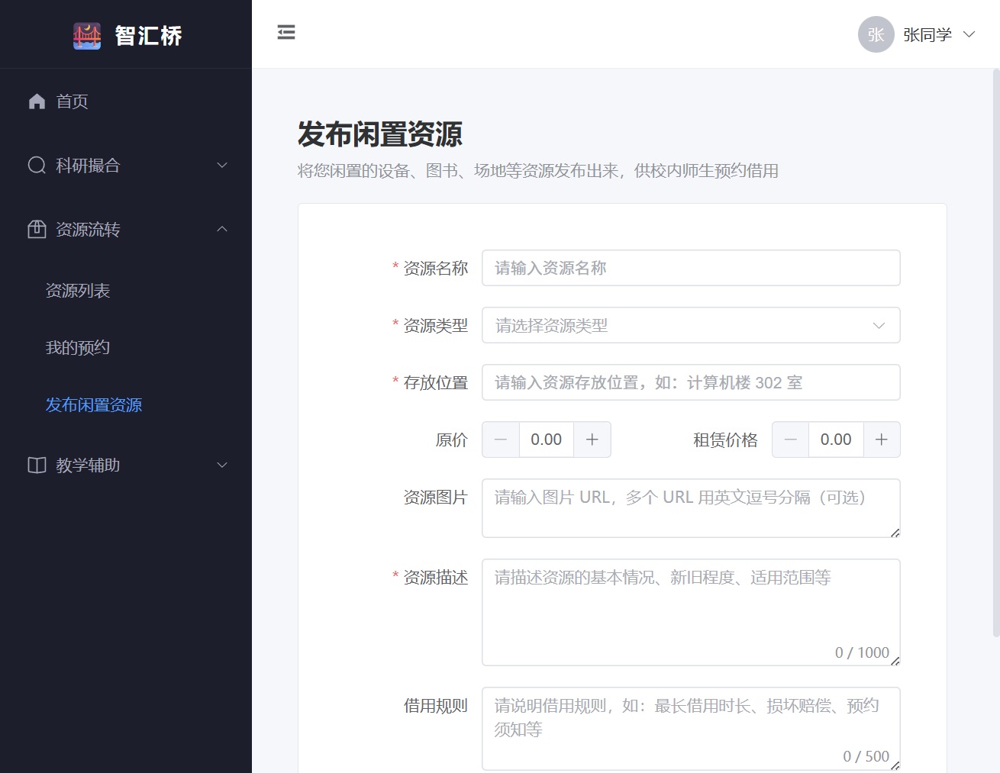
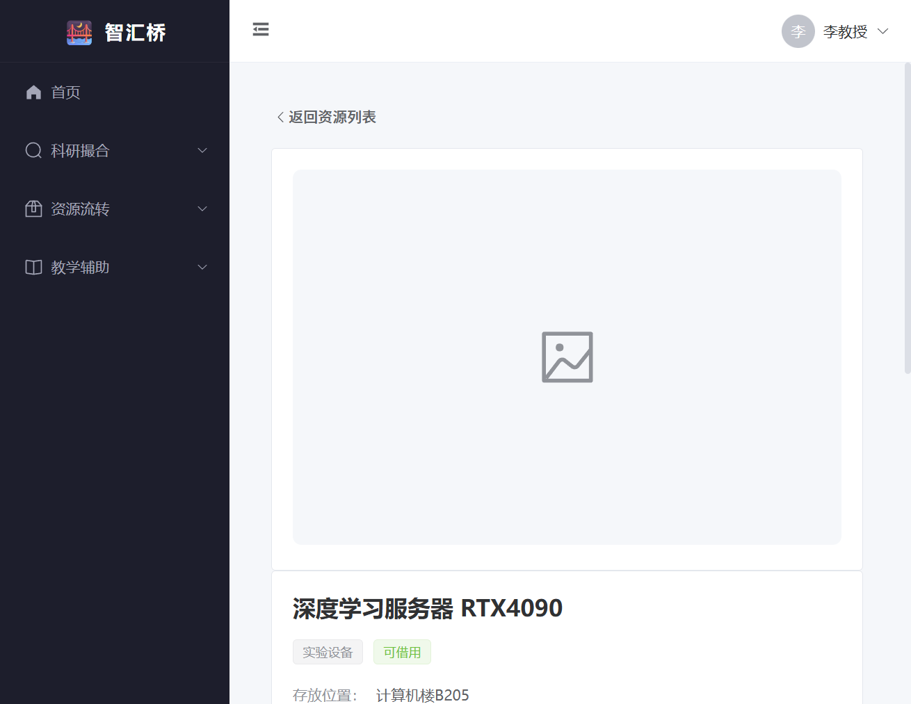
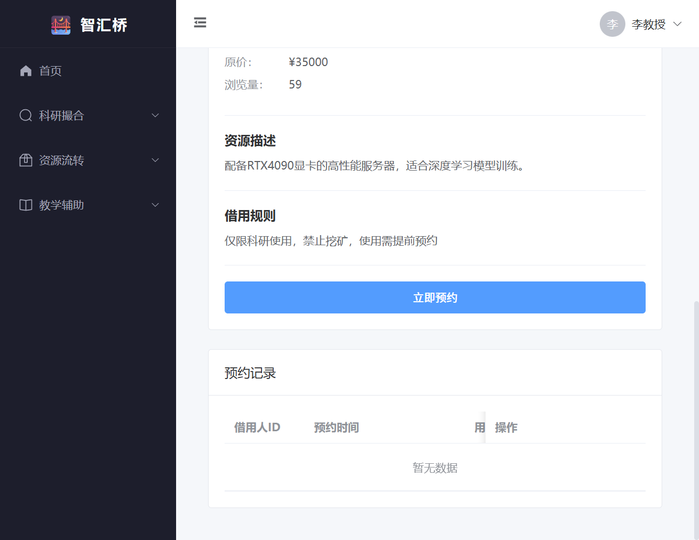
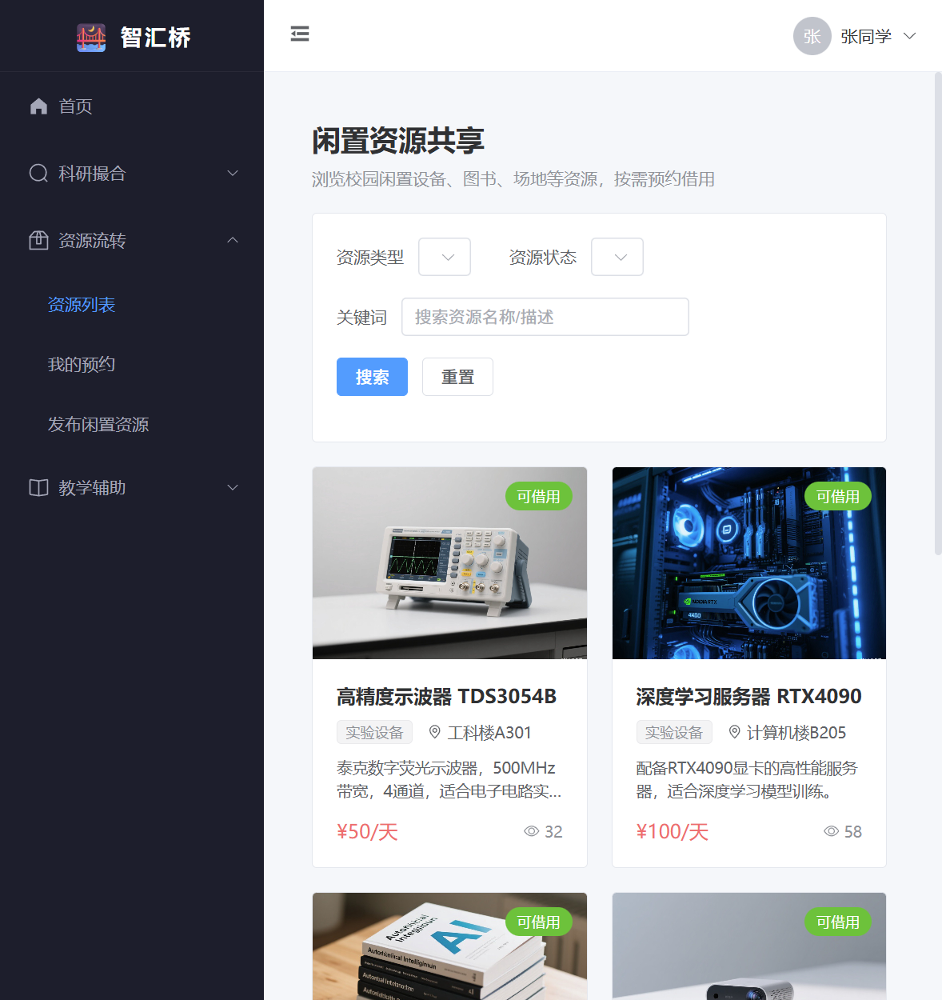

# 6月22日项目开发日志

## 「智汇桥」——AI驱动的产学研用一体化智慧协同系统

### 开发日志文档（Day 7）

---

### 一、项目基本信息

| 项目信息 | 内容 |
|---------|------|
| 项目名称 | 智汇桥——AI驱动的产学研用一体化智慧协同系统 |
| 项目定位 | 连接教师、学生、实验室与校企资源，打造师-生-机协同的智慧校园中心 |
| 核心模块 | 科研项目智能撮合、校园闲置资源流转、教学辅助个性化支持 |
| 前端技术栈 | Vue 3.5 + Vite 8 + Element Plus 2.14 + Pinia 3 + Vue Router 5 + Axios |
| 后端技术栈 | Spring Boot 3.1.6 + JDK 17 + MyBatis-Plus 3.5.6 + Spring Security + JWT |
| 数据库 | MySQL 8.0（UTF8MB4 编码） |
| 文档日期 | 2026年6月22日 |

---

### 二、今日工作目标

Day 7 的核心目标是完成**资源流转模块前端页面**的开发与前后端联调，确保资源列表展示、资源详情查看、预约申请、预约审批/归还、我的预约、发布闲置资源等全流程跑通。

具体目标包括：

1. 完善资源列表页与资源详情页的交互体验。
2. 新增「我的预约」页面，展示当前用户的预约记录。
3. 新增「发布闲置资源」页面，支持用户发布可借用资源。
4. 在路由与侧边栏菜单中注册新页面入口。
5. 修复资源预约接口中的日期格式解析问题。
6. 完善后端「发布闲置资源」接口，自动从 SecurityContext 获取所有者 ID。
7. 完善后端「我的预约列表」接口，返回资源名称便于前端展示。
8. 前后端联调验证资源预约全流程。
9. 截取关键页面截图，整理到 `docs/day7/` 目录，并写入开发日志。

---

### 三、今日完成内容

#### 3.1 资源列表页与详情页现状

Day 7 开始时，资源流转模块的前端页面已具备基础骨架：

- `src/views/resource/ResourceList.vue`：资源卡片列表、分类筛选、状态筛选、关键词搜索、分页。
- `src/views/resource/ResourceDetail.vue`：资源详情展示、图片预览、借用规则、预约弹窗、预约记录、所有者审批/归还入口。
- `src/api/resource.ts`：资源列表、详情、预约、审批、归还、我的预约、发布资源等 API 封装。

今日在此基础上补充了「我的预约」和「发布闲置资源」两个页面，并修复了联调过程中发现的接口问题。

---

#### 3.2 新增「我的预约」页面

文件：`src/views/resource/MyBookings.vue`

完成内容：

- 以学生/教师身份展示当前登录用户提交的所有资源预约记录。
- 表格展示：资源名称（可跳转详情）、预约时间段、用途说明、预约状态、审批回复、申请时间、操作按钮。
- 使用 `el-tag` 根据状态渲染不同颜色：`pending`（待审批）、`approved`（已通过）、`rejected`（已拒绝）、`ongoing`（使用中）、`returned`（已归还）、`cancelled`（已取消）。
- 对「已通过/使用中」状态提供「归还」按钮，对「待审批」状态提供「取消」按钮占位（取消接口待后续补齐）。

关键逻辑说明：

```typescript
// 加载我的预约列表
async function loadMyBookings() {
  if (!userStore.userInfo?.id) {
    ElMessage.warning('请先登录')
    return
  }
  loading.value = true
  try {
    const res: any = await getMyBookings(userStore.userInfo.id)
    bookingList.value = res.data || []
  } catch (error) {
    ElMessage.error('加载预约记录失败')
    console.error(error)
  } finally {
    loading.value = false
  }
}

// 归还资源
async function handleReturn(id: number) {
  try {
    await ElMessageBox.confirm('确定该资源已归还吗？', '提示', {
      confirmButtonText: '确定',
      cancelButtonText: '取消',
      type: 'warning'
    })
    const res: any = await returnResource(id)
    if (res.code === 200) {
      ElMessage.success('归还成功')
      loadMyBookings()
    } else {
      ElMessage.error(res.message || '归还失败')
    }
  } catch (error) {
    if (error !== 'cancel') {
      console.error(error)
    }
  }
}
```

---

#### 3.3 新增「发布闲置资源」页面

文件：`src/views/resource/ResourcePublish.vue`

完成内容：

- 开发完整的闲置资源发布表单，包含：资源名称、资源类型、存放位置、原价、租赁价格、资源图片、资源描述、借用规则等字段。
- 使用 Element Plus 表单校验，确保必填字段完整。
- 提交时自动携带当前登录用户 `ownerId`。
- 发布成功后跳转至资源列表页。

关键表单字段：

```vue
<el-form-item label="资源名称" prop="resourceName">
  <el-input v-model="form.resourceName" placeholder="请输入资源名称" clearable />
</el-form-item>

<el-form-item label="资源类型" prop="resourceType">
  <el-select v-model="form.resourceType" placeholder="请选择资源类型" style="width: 100%">
    <el-option label="实验设备" value="实验设备" />
    <el-option label="图书资料" value="图书资料" />
    <el-option label="办公用品" value="办公用品" />
    <el-option label="电子数码" value="电子数码" />
    <el-option label="场地空间" value="场地空间" />
    <el-option label="其他" value="其他" />
  </el-select>
</el-form-item>
```

---

#### 3.4 更新路由与侧边栏菜单

文件：`src/router/index.ts`、`src/layout/MainLayout.vue`

完成内容：

- 在路由表中注册新页面：
  - `/app/resource/publish` —— 发布闲置资源
  - `/app/resource/bookings` —— 我的预约
- 在主布局「资源流转」子菜单中新增：
  - 资源列表
  - 我的预约
  - 发布闲置资源

侧边栏效果截图见下方「资源列表页」。

---

#### 3.5 后端接口完善

##### 3.5.1 发布闲置资源接口自动设置所有者

文件：`src/main/java/com/zhihuiqiao/controller/ResourceController.java`

问题：前端发布资源时传递了 `ownerId`，但若未传递或伪造，会导致资源所有者不明确。

优化方案：与科研项目发布接口保持一致，从 `SecurityContext` 获取当前登录用户 ID，强制设置为资源所有者。

```java
@Operation(summary = "发布闲置资源")
@PostMapping("/publish")
public Result<Long> publishResource(@RequestBody @Valid IdleResource resource) {
    // 从 SecurityContext 获取当前登录用户 ID，设置为资源所有者
    Authentication authentication = SecurityContextHolder.getContext().getAuthentication();
    if (authentication != null && authentication.getCredentials() instanceof Long userId) {
        resource.setOwnerId(userId);
    }
    resource.setStatus("available");
    resource.setViews(0);
    idleResourceService.save(resource);
    return Result.success(resource.getId());
}
```

##### 3.5.2 我的预约列表返回资源名称

文件：`src/main/java/com/zhihuiqiao/controller/ResourceController.java`

优化：在返回我的预约列表时，根据 `resourceId` 查询资源名称并填充到响应中，避免前端二次查询。

```java
@Operation(summary = "查询我的预约列表")
@GetMapping("/booking/my")
public Result<List<ResourceBooking>> listMyBookings(@RequestParam Long borrowerId) {
    LambdaQueryWrapper<ResourceBooking> wrapper = new LambdaQueryWrapper<>();
    wrapper.eq(ResourceBooking::getBorrowerId, borrowerId)
            .orderByDesc(ResourceBooking::getCreateTime);
    List<ResourceBooking> bookings = resourceBookingService.list(wrapper);
    // 填充资源名称，便于前端展示
    bookings.forEach(booking -> {
        IdleResource resource = idleResourceService.getById(booking.getResourceId());
        if (resource != null) {
            booking.setResourceName(resource.getResourceName());
        }
    });
    return Result.success(bookings);
}
```

##### 3.5.3 修复日期格式解析问题

文件：`src/main/java/com/zhihuiqiao/entity/ResourceBooking.java`

问题：前端 `el-date-picker` 使用 `value-format="YYYY-MM-DD HH:mm:ss"`，提交如 `"2026-06-23 09:00:00"` 的字符串。Spring Boot 默认的 `LocalDateTime` 反序列化只支持 ISO 格式，导致后端解析失败，返回「系统繁忙」。

修复方案：在 `ResourceBooking` 的所有 `LocalDateTime` 字段上添加 `@JsonFormat(pattern = "yyyy-MM-dd HH:mm:ss")` 注解，使前后端日期格式保持一致。

```java
/**
 * 开始时间
 */
@JsonFormat(pattern = "yyyy-MM-dd HH:mm:ss")
private LocalDateTime startTime;

/**
 * 结束时间
 */
@JsonFormat(pattern = "yyyy-MM-dd HH:mm:ss")
private LocalDateTime endTime;

/**
 * 实际归还时间
 */
@JsonFormat(pattern = "yyyy-MM-dd HH:mm:ss")
private LocalDateTime returnTime;

/**
 * 创建时间
 */
@JsonFormat(pattern = "yyyy-MM-dd HH:mm:ss")
private LocalDateTime createTime;

/**
 * 更新时间
 */
@JsonFormat(pattern = "yyyy-MM-dd HH:mm:ss")
private LocalDateTime updateTime;
```

修复后，前端通过预约弹窗提交的时间字符串可被后端正常解析，预约流程完全跑通。

---

#### 3.6 前后端联调验证

验证环境：

- 后端服务端口：`8081`
- 前端开发服务器端口：`5174`
- 测试账号：
  - 学生：`student01 / 123456`
  - 教师：`teacher01 / 123456`

验证流程：

1. 学生登录后访问资源列表页，筛选、搜索、分页功能正常。
2. 学生进入资源详情页，查看资源信息、借用规则、预约记录。
3. 学生点击「立即预约」，选择时间段并填写用途，提交后预约记录生成成功。
4. 学生访问「我的预约」页，列表正确展示预约记录及状态。
5. 教师登录后进入自己发布的资源详情页（如深度学习服务器），底部预约记录表格展示审批入口（通过/拒绝/归还）。
6. 教师/学生访问「发布闲置资源」页，填写表单发布新资源，发布成功后可在列表页查看。
7. 前端 `npm run build` 构建通过。

---

### 四、关键页面截图

以下截图为 Day 7 完成后，使用测试账号在本地开发环境实际访问各页面所得，图片统一存放于 `docs/day7/` 目录。

#### 4.1 登录页



> 登录页使用统一认证布局，输入账号密码后自动写入 JWT Token 并跳转系统首页。

---

#### 4.2 资源列表页



> 资源列表页以卡片形式展示闲置资源，支持按资源类型、资源状态筛选和关键词搜索。侧边栏「资源流转」子菜单已新增「我的预约」和「发布闲置资源」入口。

---

#### 4.3 资源详情页（学生视角）



> 资源详情页左侧展示资源大图与缩略图，右侧展示资源名称、类型、状态、价格、位置、描述、借用规则及「立即预约」按钮。

---

#### 4.4 资源预约弹窗



> 学生点击「立即预约」后弹出预约对话框，选择开始时间、结束时间并填写用途说明即可提交。

---

#### 4.5 预约成功后的详情页



> 预约提交成功后，页面下方的「预约记录」表格新增一条「待审批」记录，资源所有者可在该表格执行审批操作。

---

#### 4.6 我的预约列表页



> 「我的预约」页以表格形式展示当前用户的所有预约记录，包含资源名称、预约时间段、用途、状态、审批回复及操作按钮。

---

#### 4.7 发布闲置资源页



> 用户可在此发布新的闲置资源，填写资源名称、类型、位置、价格、图片、描述和借用规则，发布成功后跳转资源列表页。

---

#### 4.8 资源详情页（所有者视角）



> 教师/资源所有者进入自己发布的资源详情页，预约记录表格会显示审批操作入口（通过/拒绝/归还）。

---

#### 4.9 预约审批管理



> 资源所有者可在详情页对预约申请进行「通过」「拒绝」或「归还」操作，审批通过后资源状态自动变为「已借出」。

---

#### 4.10 资源列表 AI 配图效果



> 使用 TRAE `text_to_image` 接口为每条闲置资源生成对应 AI 图片，并写入数据库 `images` 字段。资源列表页卡片现在可以正常显示示波器、服务器、图书、投影仪、会议室等真实配图，不再显示占位图。
> 
> 同时清理了因 `spring.sql.init.mode=always` 导致的 70 余条重复资源记录，并将该配置改为 `never`，防止后续重启再次插入重复数据。

---

### 五、遇到的问题与解决方法

| 序号 | 问题描述 | 原因分析 | 解决方法 |
|------|---------|---------|---------|
| 1 | 资源预约提交后后端返回「系统繁忙」 | 前端 `el-date-picker` 返回 `YYYY-MM-DD HH:mm:ss` 格式字符串，后端 `LocalDateTime` 默认只支持 ISO 格式 | 在 `ResourceBooking` 实体类的所有 `LocalDateTime` 字段上添加 `@JsonFormat(pattern = "yyyy-MM-dd HH:mm:ss")` |
| 2 | 我的预约列表不显示资源名称 | 后端 `ResourceBooking` 实体没有资源名称字段 | 添加 `@TableField(exist = false)` 的 `resourceName` 字段，并在 `listMyBookings` 接口中填充 |
| 3 | 发布闲置资源接口未校验所有者 | 后端直接保存前端传入的 `ownerId`，存在伪造风险 | 在 `publishResource` 中从 `SecurityContext` 获取当前登录用户 ID 并强制设置为 `ownerId` |
| 4 | 资源列表页全部显示占位图 | `idle_resource` 表积累大量重复记录，且 `images` 字段为无效占位 URL；`spring.sql.init.mode=always` 导致每次重启都插入重复数据 | 使用 TRAE `text_to_image` 接口生成 AI 图片 URL 写入数据库；清理重复记录；将 `spring.sql.init.mode` 改为 `never` |

---

### 六、明日工作计划（2026年6月23日）

| 序号 | 工作内容 | 预计产出 |
|------|---------|---------|
| 1 | 开发教学辅助模块后端（学习资源、学习记录、收藏） | 教学模块基础 API |
| 2 | 开发教学辅助模块前端（学习资源列表、学习中心） | 教学模块页面与联调 |
| 3 | 首页数据看板与管理后台页面开发 | 首页展示统计数据 |
| 4 | 编写接口测试与完善异常处理 | 系统更稳定 |

---

### 七、备注

- 今日已完成资源流转模块前端全部核心页面开发与联调，资源列表、资源详情、预约申请、我的预约、发布资源、审批/归还等功能均验证通过。
- 前端生产构建通过，无阻塞性错误。
- 所有关键页面截图已保存至 `docs/day7/` 目录，并嵌入本日志文档。
- 补充了资源列表 AI 配图效果截图与问题记录。
- 明日重点推进教学辅助模块开发与首页数据看板。

**记录人**：罗智峰  
**日期**：2026年6月22日
